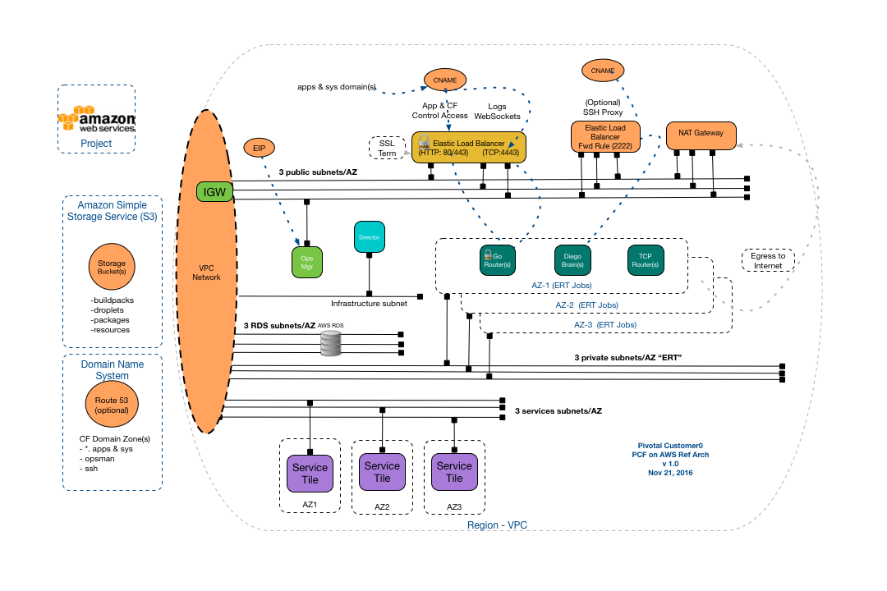

#Pivotal Customer0 _PCF on AWS_ Reference Architecture

*__Goal__*:  Customer0 Reference Architectures are utilized by Pivotal's Customer0 group to _simulate_ a base deployment of our products that is common to as many customer use cases as possible.  These architectures are then automated via concourse pipelines and _'validated'_ thru various customer0 validation scenarios to simulate typical customer use cases.

######* Customer0[Typical Customer] * = _A secured but publicly accessible PCF Foundation, capable of hosting ~100 Application instances with PCF managed Services: "Mysql, RabbitMQ, Pivotal Spring Cloud Services"_

*__Non-Goals__*:

- This PCF on AWS reference architecture is published as is with no warranty or support expressed or implied!
- This document is NOT intended to replace the basic installation documentation located @ [http://docs.pivotal.io/pivotalcf/1-8/customizing/cloudform.html](http://docs.pivotal.io/pivotalcf/1-8/customizing/cloudform.html), but rather to demonstrate how those instructions should be related to a typical/recommended Pivotal Cloud Foundry Installation on AWS.

*__Validation Key Info__*: (STATUS=Validation In Progress)

| PCF Products Validated        | Version                  | Known Issues              |
| -----------------------------:|:-------------------------|:-------------------------|

## Reference Architecture IaaS Overview

PCF on AWS Reference Architecture Overview (*c0-aws-base*):

- [Pipeline Repo Link](https://github.com/c0-ops/aws-concourse) : Customer0 Concourse Pipelines
- [Running Pipeline Link](https://fly.customer0.net/teams/main/pipelines/c0-aws-deploy-ert-base) : See the Running Customer0 Concourse Pipelines

### __PCF on AWS requires the following AWS Components__:

##### VPC/Region/AZ/Subnet

A Cloud Foundry Deployment will exist within a single VPC.  It will be located in a single AWS region and should distribute Cloud Foundry Jobs/Instances across 3 AWS Availability Zone to ensure a high degree of availability.

##### EC2 Instance Quota

Default quota on a new AWS subscription only has around 20 EC2 instances, which is not enough to host a multi-az deployment.
The recommend quota for EC2 instances is 100. AWS require the instances quota tickets to include Primary Instance Types, which should be t2.micro

##### Service Accounts

Best practice PCF on AWS deployments requires 2 "Service Accounts"

1. Admin Account -> "For Terraforming"

   - Terraform will use this admin account to provision required AWS resources as well as an IAM service account

2. IAM Service Account -> "For OpsMan/BOSH"

   - The service account will be automatically provisioned with restricted access only to PCF needed resources. [C0 AWS IAM ](https://github.com/c0-ops/aws-concourse/blob/master/terraform/c0-aws-base/iam.tf)

##### Networks

Review Pipeline Network objects here: [C0 AWS Pipeline Terraform Network Objects](https://github.com/c0-ops/aws-concourse/blob/master/terraform/c0-aws-base/vpc.tf#L25)

Each AWS subnet must reside entirely within one AZ. As a result a multi-AZ deployment topologies require corresponding multi-subnets

- **Subnets**

  1. 1 *"Infrastructure"* subnet <->  This network will host:
    - _["Bosh Director"]_
	2. 3 *"public"* subnets <->  These networks will host:
		- _["OpsManager", "Elastic Load Balancers", "NAT Gateway"]_
	3. 3 *"ert"* subnets <-> These networks will host the core instances of cloud foundry:
	   - _["GoRouters","Diego Cells","Cloud Controllers", "etc..."]_
	4. 3 *"services"* subnets <->  These networks ,as well as additional service networks, will host PCF managed service tiles:
  	 - _["Rabbit","Mysql","Spring Cloud Services", "etc..."]_
  5. 3 *"RDS"* subnets <->  These networks will hosts the PCF management databases:
     - _["Cloud Controller DB","UAA DB","etc..."]_   

  *Note*: Since AWS subnet must reside entirely within each AZ, in order to forward traffic from ELB to all the gorouters across multi AZs, ELB has to sits on all three public subnets matching ERT AZs.

- **Routes**

	Routes are created by AWS terraform pipeline that associates to each subnet:

  * PublicSubnetRouteTable
    This routing table enable the ingress/egress routes from/to internet through internet gateway for OpsManager, NAT Gateway
  * PrivateSubnetRouteTable
    This routing table enable the egress routing to the internet through the NAT Gateway for Bosh Director, ERT

  *Note*: If an EC2 instance sits on a subnet with an Internet gateway attached as well as a public IP, it is accessible from the internet through the public IP. E.g. OpsManager

##### Security Groups

Review Pipeline Security Group here:[C0 AWS Pipeline Terraform Security Group Rules](https://github.com/c0-ops/aws-concourse/blob/master/terraform/c0-aws-base/security_group.tf)

*Needs to discuss the pipeline implementation*

By default the Egress rules on all the security groups are wide open (ALL Protocol/To 0.0.0.0/0)

This table describes the security groups *ingress* rules:

|Security Group| Port | From CIDR | Protocol |Description |
|-----------------------------:|:-------------------------|:-------------------------|:-------------------------|:-------------------------|
|OpsMgrSG|22|0.0.0.0/0|TCP|Ops Manager SSH Access|
||443|0.0.0.0/0|TCP|Ops Manager https Access|
|VmsSG|ALL|VPC_CIDR|ALL|Open up connections among bosh deployed VMs|
|MysqlSG|3306|VPC_CIDR|TCP|Enable network access to RDS|
|ElbSG|80|0.0.0.0/0|TCP|http to elastic runtime|
||443|0.0.0.0/0|TCP|https to elastic runtime|
||4443|0.0.0.0/0|TCP|Web socket connection to log aggregator endpoint|
|SshElbSG|2222|0.0.0.0/0|TCP|ssh connection to containers|

*Note*: The extra port of 4443 with ELB is due to the limitation that ELB does not support websocket on HTTP/HTTPS (layer 7).

##### Load Balancing

PCF on AWS requires Elastic Load Balancer (ELB). It can be configured with multiple listeners to forward http/https/tcp traffics. We recommend to configure two ELBs:

1. Forward the traffic to gorouter (PcfElb)
2. Forward the traffic to diego brain ssh proxy (PcfSshElb)

This table describes required listeners:

|ELB|Instance/Port | LB Port|Protocol|Description |
|-----------------------------:|:-------------------------|:-------------------------|:-------------------------|:-------------------------|
|PcfElb|gorouter/80|80|http|Forward Traffic to gorouter|
||gorouter/80|443|https|SSL Termination and forward traffic to gorouter|
||gorouter/80|4443|ssl|SSL Termination and forward traffic to gorouter|
|PcfSshElb|diego-brain/2222|2222|tcp|Forward Traffic to diego brain for container ssh connections|

Each ELB binds with a health check to check the health of the back end instances:

* PcfElb checks the health on gorouter port 80 with TCP protocol
* PcfSshElb checks the health on diego-brain port 2222 with TCP protocol

##Pivotal Customer0 PCF on AWS Deployment Pipeline

*Future Work*

##PCF on GCP Helpful Links

*Future Work*
