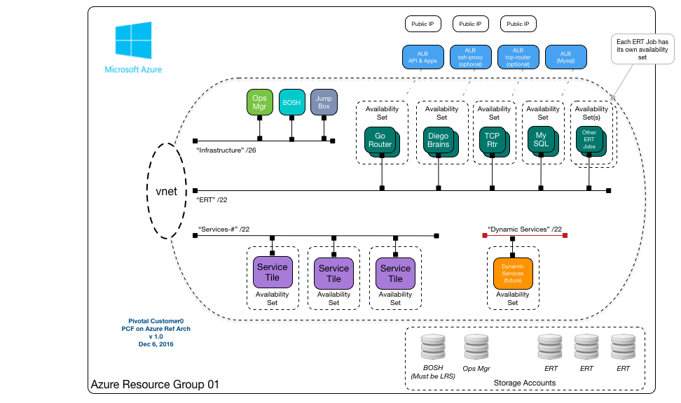
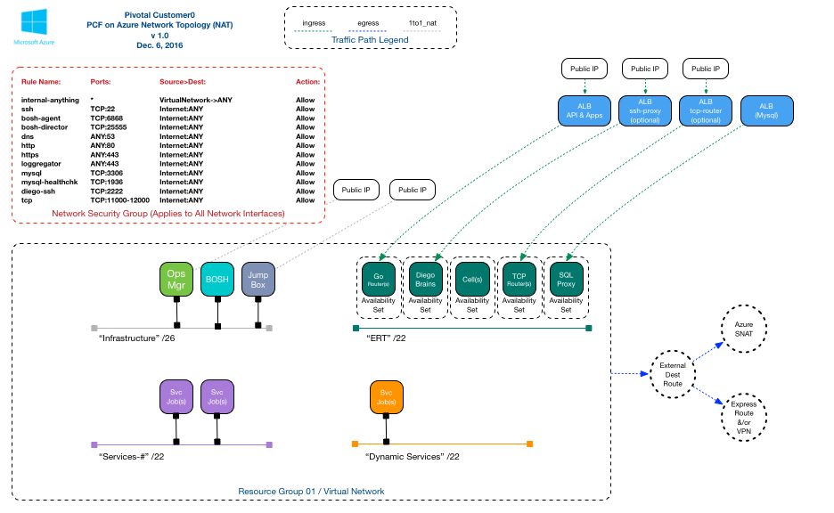
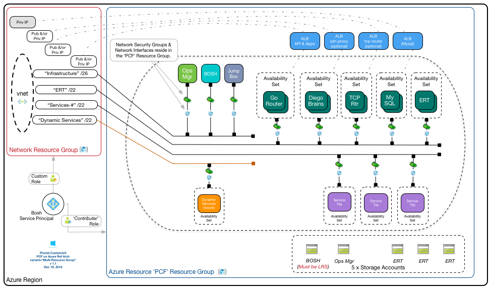

#Pivotal Customer[0] Azure Reference Architecture

__Summary__: Customer[0] Reference Architectures are utilized by Pivotal's Customer[0] group to simulate a base deployment of our products that is common to as many customer use cases as possible. These architectures are then automated via concourse pipelines and 'validated' thru various Customer[0] validation scenarios to simulate common customer use cases.

This PCF on Azure reference architecture is published as is with no warranty or support expressed or implied.

Validation Key Info (STATUS=Draft WIP)

| PCF Products Validated        | Version                   |
| ----------------------------- |:-------------------------:|
| PCF Ops Manager               | 1.8.latest |
| Elastic Runtime               | 1.8.latest                |

### Pivotal Customer[0] Reference Architecture Overview

  

  - [Pipeline Repo Link](https://github.com/c0-ops/azure-concourse) : Customer[0] Concourse Pipelines
  - [Pipeline ERT Repo Link](https://github.com/c0-ops/ert-concourse) : Customer[0] Concourse Pipelines
  - [Running Pipeline Link](https://fly.customer0.io/teams/main/pipelines/azure-base-ci) : See the Running Customer[0] Concourse Pipelines
  - [Customer0 slack channel](http://pivotal.slack.com/customer0)

This model shows a single PCF deployment in a single Azure Resource Group. Azure does not provide resource that maps as a traditional PCF availability zone.  IaaS Availability is provided via _**Availability Sets**_.

The 'base' reference approach is to create a single Resource Group, populate it with the required Azure constructs and then deploy PCF with Pivotal Operations Manager.  Core networking is created via an Azure virtual network with the following subnets:

  - Infrastructure
  - ERT (_Elastic Runtime_)
  - Service tiles
  - Dynamic or On Demand Service tiles

### IaaS Architecture

Core Azure architectural constructs required to deploy PCF:

  - (1) Service Principal Account bound to an Azure Active Directory (ADD) Application for BOSH to interact with the API.  

    - Documentation for creating the Service Principal can be found  [here](http://docs.pivotal.io/pivotalcf/1-8/customizing/azure-prepare-env.html)
    - See the _**c0-azure-multi-res-group**_ Pipeline Variant for information on limiting the Service Principal account in a common customer scenario.

  - (1 or 2) Resource Group(s) per PCF installation.

     - the _**c0-azure-base**_ Pipeline Variant utilizes a single Resource Group for all azure objects.  Customers wishing to control access to Azure networking objects may choose to architect a dedicated 'Network' Resource Group for Azure virtual nets and other key networking objects, and provision a dedicated 'PCF' Resource Group for bosh to deploy objects.  A single Service principal will be created but its access will be limited to mainly READ actions on the 'Network' Resource Group via a custom role.  
     - See the _**c0-azure-multi-res-group**_ Pipeline Variant for information.

  - (\*) Availability Sets created by BOSH for each deployment job type

     - Availability sets provide a IaaS capability of allocating BOSH jobs across 1 or more fault or upgrade domains.   This will allow most Azure failures to not take down a complete job.  
     - Each BOSH job in Pivotal PCF releases will get their own availability set.
     - If a single Azure Fault Domain were to fail, and the affected jobs had >1 instances in an availability set,  the other instances would remain un-affected
     - See [here](https://docs.microsoft.com/en-us/azure/virtual-machines/virtual-machines-windows-manage-availability) for more information on Azure Availability Sets

  - (1) Virtual Network (vnet) with a large range of address space that will be sub-divided
    - Example: 10.xxx.yyy.0/20
      - (1) Infra 10.xxx.yyy.0/26
      - (1) ERT 10.xxx.yyy.0/22
      - (1) Services-# 10.xxx.yyy.0/22
      - (1) Dynamic Service-# 10.xxx.yyy.0/22

     **Note that a subnet is a logical component bound to a single Virtual Network and must exist in the the same Resource Group.  In Multi Resource Group deployments, as long as 'Network' & 'PCF' Resource Groups share the same region for PCF deployments, BOSH Jobs/VMs in one resource group can attach to networks in another.**

  - (1) Network Security Group (NSG) - to meet security requirements, firewall rules that apply to network interfaces

  (_Ops Manager for Azure currently limits PCF Deployments to 1 security group_)

  - (4) Azure Load Balancers (ALBs)
    - (1) Public app access for API (or Control Path) and Apps (or Data Path)
    - (1) Internal use, for example MySQL
    - (1) _**Optional**_ TCP Routers, if option is selected
    - (1) _**Optional**_ SSH Proxy

  - (5) Standard Storage Accounts to match deployment needs (\*see caveats)
    - (1) Ops Manager
    - (1) BOSH
    - (3) ERT and other tile deployments
    - Azure Storage Accounts have an IOPs limit (~20k, per each account) which generally relates to a BOSH JOB/VM limit of ~20 VMs each. Consumers aren't charged by the qty of Storage Accounts but rather by consumption.

  - (1) Jump Box on the Infra network to provide CLI tools

    - A practical jump box inside your Azure deployment can be very useful. A Linux VM with a number of useful CLIs pre-installed is recommended:

        - Azure CLI (node.js dependent)
        - BOSH CLI
        - Pivotal Customer[0] enaml & omg CLI
        - traceroute
        - nmap
        - CFOps
        - UAA CLI
        - netsec
        - getmap
        - CF CLI

  - (1 - 5) Public IPs
    - (1) VIP for ALB for CF domains (sys. and apps.)
    - (1) SSH into jump box
    - Optional (1) VIP for ALB to TCP Routers
    - Optional (1) HTTPS Ops Manager
    - Optional (1) SSH Proxy to Diego Brains

  **NOTE: Public IPs are not mandated if deploying with a VPN or Express Route Solution that does not require public IP access**

### Network Topology



  - NSGs
    - Documentation for creating NSGs can found [here](http://docs.pivotal.io/pivotalcf/1-8/customizing/azure-om-deploy.html)
    - MG **Will Add Dwallraff's recent work soon**
  - Application Security Groups
    - _Doc in Progress_
  - Azure Load Balancer Topology
    - HAProxy Job is not recommended for a production deployment, instead use a highly-available azure-provided load balancing solution. For more information look [here](http://docs.pivotal.io/pivotalcf/1-8/opsguide/ssl-term-haproxy.html)
  - IaaS Specific VPN Architecture (Express Route/Home Grown VPN)
    - _Doc in Progress_
  - Azure API Manager * (Optional)
     - _Doc in Progress_
  - GSLB Setup * (Optional)
     - _Doc in Progress_

### Pipeline Variants

Customer0 will 'validate' a limited number of variant scenarios from the Base template.

| Variant *{{azure__pcf_terraform_template}}*| Varient Description                   |
| -----------------------------:|:-------------------------|
|c0-azure-base|Base Template, single resource group, DNS integrated with C0 Dyn|
|c0-azure-poc|Base Template, with reduced number of cells and pipeline pause for manual DNS setup||
|c0-azure-multi-res-group|Multi Resource Group deployment, DNS integrated with C0 Dyn||
|c0-azure-multi-res-group-multi-lb|Multi Resource Group - Multi Load Balander deployment, No pipeline||

##### c0-azure-multi-res-group



Key Design Points:

- Dedicated 'Network' Resource Group, limits BOSH Service Principal to not have admin access to network objects.
- Custom Role for BOSH Service Principal, applied to 'Network' Resource Group, limiting to minimum access

   ```
   {
    "Name": "PCF Network Read Only",
    "IsCustom": true,
    "Description": "MVP PCF Read Network Resgroup",
    "Actions": [
      "Microsoft.Network/networkSecurityGroups/read",
      "Microsoft.Network/networkSecurityGroups/join/action",
      "Microsoft.Network/publicIPAddresses/read", <----- Only Required if Using Public IPs
      "Microsoft.Network/publicIPAddresses/join/action",  <----- Only Required if Using Public IPs
      "Microsoft.Network/loadBalancers/read",
      "Microsoft.Network/virtualNetworks/subnets/read",
      "Microsoft.Network/virtualNetworks/subnets/join/action",
      "Microsoft.Network/virtualNetworks/read"
    ],
    "NotActions": [],
    "AssignableScopes": ["/subscriptions/[YOUR_SUBSCRIPTION_ID]"]
   }
   ```

- Custom Role for BOSH Service Principal, applied to Subscription, allowing Terraform to function

   ```
   {
       "Name": "PCF Terraform Min Perms",
       "IsCustom": true,
       "Description": "MVP PCF Terraform Perms",
       "Actions": [
         "Microsoft.Compute/register/action"
       ],
       "NotActions": [],
       "AssignableScopes": ["/subscriptions/[YOUR_SUBSCRIPTION_ID]"]
   }
   ```

##### c0-azure-multi-res-group-multi-lb


Key Design Points:

- Two load balanced paths to PCF
  - One path to the ALB for API access which consumes a private IP that DNS resolves to the system domain.
  - One path to the ALB for Application access which consumes a public or private IP that DNS resolves to the apps domain.
- At this time, Azure does not allow the go-routers to be members of more than one Azure load balancer (ALB) member pool for the same port(s) (i.e. 80 & 443). This requires an additional reverse proxy to front the go-routers to allow it to expose traffic on these ports for the system domain.
