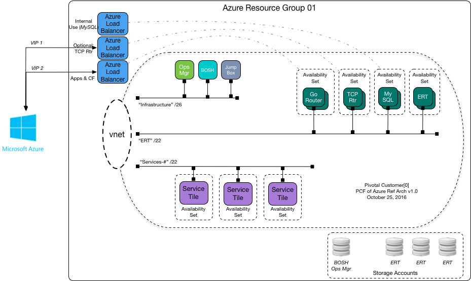

#Pivotal Customer0 Azure Reference Architecture

Summary:  What we are & aren't providing with this ref arch.    No warranty implied or expressed!

Validation Key Info (Date last Updated)

| PCF Products Validated        | Version                   |
| ----------------------------- |:-------------------------:|
| PCF Ops Manager               | 1.8.?	(Link to Pipelines) |
| Elastic Runtime               | 1.8.?                         |
| future                        | ? 		                    |
| future                        | ? 	                      |
| future                        | ? 		                    |

### Pivotal Customer0 Reference Architecture Overview

  

This model shows a single PCF deployment in a single Azure Resource Group. For HA deployment, create and deploy same on a second Resource Group.

The reference approach is to create a Resource Group, populate it with a virtual network and draw three subnets from it. These three subnets will be used in a manner similar to other Customer[0] architectures, where one is used for infrastructure, one for apps and one for service tiles.

### IaaS Architecture

  ![]Image

In Azure, you will need some architectural constructs to deploy products in:
  - A Service Principal account in a Azure Active Directory (ADD) application for BOSH to use to deploy PCF with
  - A Resource Group per PCF installation, two required for HA
  - Availability Sets for each BOSH job
  - A Virtual Network with three subnets for PCF. Note that a subnet is a logical component of a single Virtual Network.
  - Network Security Groups
  - Two Azure Load Balancers (ALBs), one for public access and one for internal use (like MySQL)

### Network Topology

  ![]Image

Explain

  - Security Controls (ACLs)
  - Application Security Groups
  - Load Balancer Topology
  - Private RFC versus Public IP Addresses
  - IaaS Specific VPN Architecture (Express Route/Home Grown VPN)
  - Azure API Manager * (Optional)
  - GSLB Setup * (Optional)

### Caveats and Concerns

Azure Storage Accounts have an IOPs limit (20k, per) which generally relates to a VM limit of 20 VMs per (safely). Sive your deployments accordingly.

A practical jump box inside your Azure deployment can be very useful. A Linux VM with a number of useful CLIs pre-installed is recommended:

  1. Azure CLI
  2. BOSH CLI
  3. Pivotal enaml & omg CLI
  4. traceroute
  5. netsec
  6. getmap

Customer[0] curates a Slack channel for the Azure community at Pivotal. Visit http://pivotal.slack.com/customer0-azure for join.

#Pivotal Customer0 Deployment Pipeline

Describe what Customer0 Uses the pipeline for (Solution Validation)
[Insert Link to pipeline repo]


- Document How to use the pipeline in a POC scenario
- Document How to ref the pipeline for manual deployment steps
- Document What Customer0 Validates * (Future link to validation repos)


```
Links to Relevant Code
```
