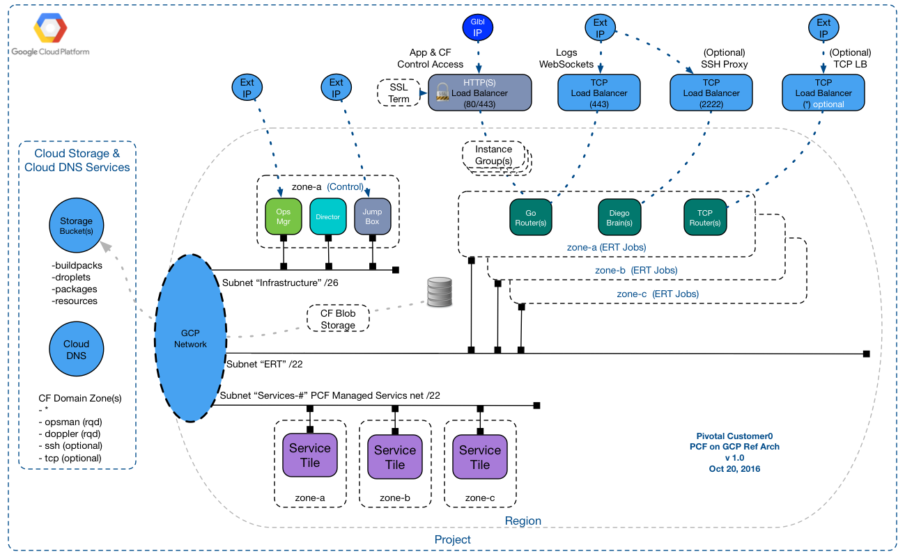
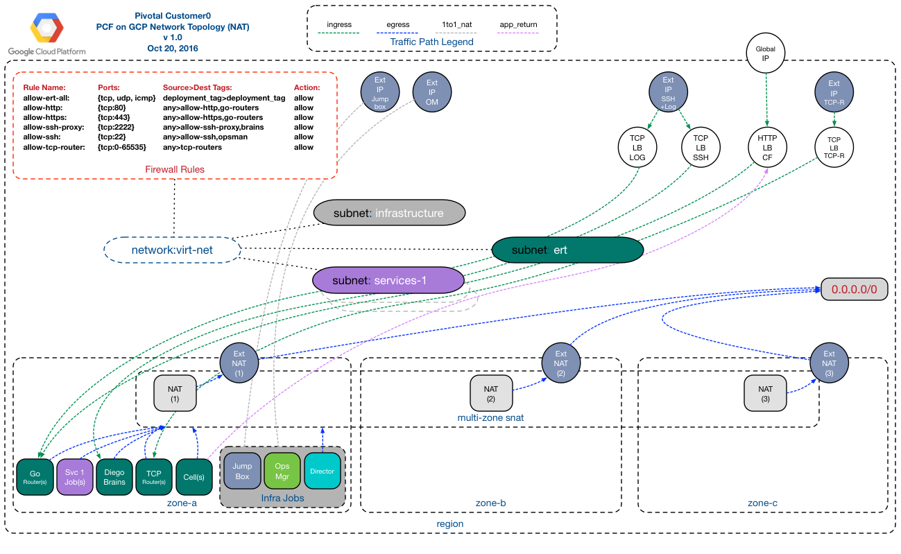

#Pivotal Customer0 _PCF on GCP_ Reference Architecture

*__Goal__*:  Customer0 Reference Architectures are utilized by Pivotal's Customer0 group to _simulate_ a base deployment of our products that is common to as many customer use cases as possible.  These architectures are then automated via concourse pipelines and _'validated'_ thru various customer0 validation scenarios to simulate typical customer use cases.

######* Customer0[Typical Customer] * = _A secured but publicly accessible PCF Foundation, capable of hosting ~100 Application instances with PCF managed Services: "Mysql, RabbitMQ, Pivotal Spring Cloud Services"_

*__Non-Goals__*:

- This PCF on GCP reference architecture is published as is with no warranty or support expressed or implied!.
- This document is NOT intended to replace basic installation documentation located @ [http://docs.pivotal.io/pivotalcf/1-8/customizing/gcp.html](http://docs.pivotal.io/pivotalcf/1-8/customizing/gcp.html), but rather to demonstrate how those instructions should be related to a typical/recommended Pivotal Cloud Foundry Installation.

*__Validation Key Info__*: (STATUS=Validation In Progress)

| PCF Products Validated        | Version                  | Known Issues              |
| -----------------------------:|:-------------------------|:-------------------------|
| PCF Ops Manager               | 1.8.10.0 (Nov 2 2016)    | PASS |
| Elastic Runtime               | 1.8.10 (Nov 2 2016       | PASS |
| Rabbit                        | 1.7.6 (Nov 2 2016)       | PASS |
| Metrics                       | 1.1.# (Latest)           | NOT YET VALIDATED |
| Mysql                         | 1.7.# (Latest)           | NOT YET VALIDATED |
| Spring Cloud Services         | 1.2.# (Latest)           | NOT YET VALIDATED |

## Reference Architecture IaaS Overview

PCF on GCP Reference Architecture Overview (*c0-gcp-base*):

- [Pipeline Repo Link](https://github.com/c0-ops/gcp-concourse) : Customer0 Concourse Pipelines
- [Running Pipeline Link](https://fly.customer0.net/teams/main/pipelines/c0-gcp-deploy-ert-base) : See the Running Customer0 Concourse Pipelines

###__PCF on GCP requires the following GCP Components__:

##### Project/Region/Zones

A Cloud Foundry Deployment will exist within a single Project.  It will be located in a single GCP region and should distribute Cloud Foundry Jobs/Instances across 3 GCP zones to ensure a high degree of availability.  Each GCP Zone will map to a Cloud Foundry Availability Zone

##### Google Cloud API

Pivotal Ops Manager & BOSH will utilize the Google Compute Engine API, it must be enabled on a new Google Cloud subscription as it is not enabled by default

#####Quotas

Default quotas on a new GCP subscription will not have enough quota for a typical PCF deployment.  This Reference Architecture has been sized to host ~100 typical Cloud Foundry AIs.   You should request a Quota increase for the following Objects:

| Resource        | Suggested Min Limit                   |
| ----------------------------- |:-------------------------:|
| CPUs *Region Specific*					|150|
| Firewall Rules				   				|15|
| Forwarding Rules				   			|5|
| Global Forwarding Rules					|5|
| Global Backend Services					|5|
| Health Checks				   				|10|
| Images				   						|10|
| Static IP Addresses *Region Specific* & Assuming SNAT topology|5|
| IP Addresses Global				   		|5|
| IP Addresses *Region Specific*	& Assuming SNAT topology|5|
| Networks 									|5|
| Subnetworks									|5|
| Routes										|20|
| Target Pools								|10|
| Target HTTP Proxies Global				|5|
| Target HTTPS Proxies Global				|5|
| Total persistent disk reserved (GB) *Region Specific* | 15,000 |

#####Service Accounts

Best practice PCF on GCP deployments requires 2 "Service Accounts"

1. Operator Account -> "For Terraforming"

   - Prior to deploying PCF on GCP, you will need a GCP account with proper permissions to create GCP objects via terraform.  Minimum permissions for this account can be found [here](http://docs.pivotal.io/pivotalcf/1-8/customizing/gcp.html#gcp).
   
2. IAM Service Account -> "For OpsMan/BOSH"

   - Ops Manager will require you to select 1 of 2 approaches for a service account for BOSH & bosh-init to use for deployments.

		- `AuthJSON`

			This option requires that the operator create an IAM svc account with appropriate permissions documented [here](http://docs.pivotal.io/pivotalcf/1-8/customizing/gcp-prepare-env.html#iam_account).  This is the preferred method of Customer0 Engineers & Reference architecture.

		- `The Ops Manager VM Service Account`

			This option polls the GCP api to get the service account `email|id` of the service account & scopes that were assigned when the OpsManager VM was created and leverages that account.  This method requires the service account have the _Project > Service Account Actor_ role

		*Note*: C0 pipeline does not currently utilize 2 service accounts.  This will be modified soon to allow the pipeline to be fully portable and simulate a customer deployment with limited creds on service accounts.
		
#####Networks

<iframe width="600" height="400" src="https://api.github.com/repos/c0-ops/gcp-concourse/contents/terraform/c0-gcp-base/2_networks.tf" frameborder="0" allowfullscreen></iframe> 

- Subnets 
- Routes
- External IPs

[Terraform Network Objects](https://raw.githubusercontent.com/c0-ops/gcp-concourse/master/terraform/c0-gcp-base/2_networks.tf)

#####FireWall Rules

- Rules

[Terraform FW Rules](https://raw.githubusercontent.com/c0-ops/gcp-concourse/master/terraform/c0-gcp-base/3_firewalls.tf)

#####Load Balancing
- Forwarding Rules

- Target Pools
- Health Checks
 
#####Instance Groups
#####Images

## Network Topology

PCF on GCP Base Network Topology (*c0-gcp-base*):

Explain Base Network Architecture & GCP Objects

  - Recommended Firewall Topology with Tags
  - GCP Project SSH Topology
  - Application Security Groups
  - Load Balancer Topology
    - 	TCP
    -  HTTPS

## Variants to BAse Reference Architecture

Will Insert Variant Image(s) here:

Customer0 will 'validate' a limited number of variant scenarios from the base topology.

| Variant *{{gcp_pcf_terraform_template}}*| Varient Description                   |
| -----------------------------:|:-------------------------|
|c0-gcp-nonat|Base template (+) No dedicated SNAT, default GCP instances each with Public IPs for SNAT| 
|c0-gcp-private|Base template (-) All External IPs, no public IPs at all||
|c0-gcp-ipsec|Base template (+) IPSEC add on||
|c0-gcp-gslb|2 x Base templates deployments Globally load balanced||

  

##Pivotal Customer0 PCF on GCP Deployment Pipeline

Describe what Customer0 Uses the pipeline for (Solution Validation)
[Insert Link to pipeline repo]

Min-Reqs to run the Pipleine ...

1. Appropriate GCP Quotas
2. [GCP Service Account](http://docs.pivotal.io/pivotalcf/1-8/customizing/gcp-prepare-env.html#iam_account)
3. [Enable GCP APIs](http://docs.pivotal.io/pivotalcf/1-8/customizing/gcp-prepare-env.html#enable_compute_resource_api)
4. A resolvable/registered DNS domain for Cloud Foundry `system` & `apps` domains
5. A [Concourse](https://concourse.ci/) instance with workers that have public access.

(ToDo) Document How to use the pipeline in a POC scenario ...

(ToDo) Document How to ref the pipeline for manual deployment steps ...

(ToDo) Document What Customer0 Validates * (Future html link to validation repos) ...

##PCF on GCP Helpful Links

- [https://cloud.google.com/solutions/cloud-foundry-on-gcp](https://cloud.google.com/solutions/cloud-foundry-on-gcp)
- [http://docs.pivotal.io/pivotalcf/1-8/customizing/gcp.html](http://docs.pivotal.io/pivotalcf/1-8/customizing/gcp.html)
- [https://github.com/cloudfoundry-incubator/bosh-google-cpi-release](https://github.com/cloudfoundry-incubator/bosh-google-cpi-release)
- [http://bosh.io/stemcells/bosh-google-kvm-ubuntu-trusty-go_agent](http://bosh.io/stemcells/bosh-google-kvm-ubuntu-trusty-go_agent)
- [http://bosh.io/releases/github.com/cloudfoundry-incubator/bosh-google-cpi-release?all=1](http://bosh.io/releases/github.com/cloudfoundry-incubator/bosh-google-cpi-release?all=1)